# Building a Game with a Continuous Deployment Pipeline from GitHub to S3

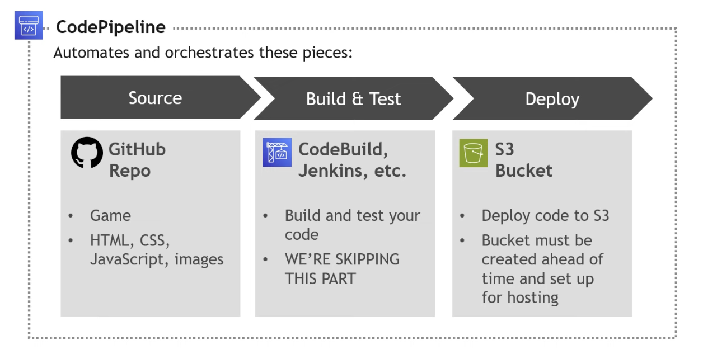

## Description
In this quick project, I explored how continuous deployment works with S3 by using an S3 bucket for static hosting of a simple memory card game. I set up a CodePipeline that pulls the game’s code from a GitHub repository and automatically deploys it to the S3 bucket. (_Guided project by @tinytechnicaltutorials_)

## Tools and Services Used
- AWS CodePipeline
- Amazon S3
- GitHub
- HTML, CSS, JavaScript

## Cost and Time
- Cost: $0 (eligible for free tier)
- Time: 30 minutes

## Key Procedures
1. Fork a GitHub repository (provided by @tinytechnicaltutorials)
2. Create an S3 bucket
3. Set up CodePipeline
4. Commit a code change in GitHub

## Step-by-Step Walkthrough
### Step 1: Fork GitHub Repository

Since the GitHub repository with the necessary game code (HTML, CSS, JavaScript files) was already provided by @tinytechnicaltutorials, I first forked the repository to work on it from my own GitHub account. 
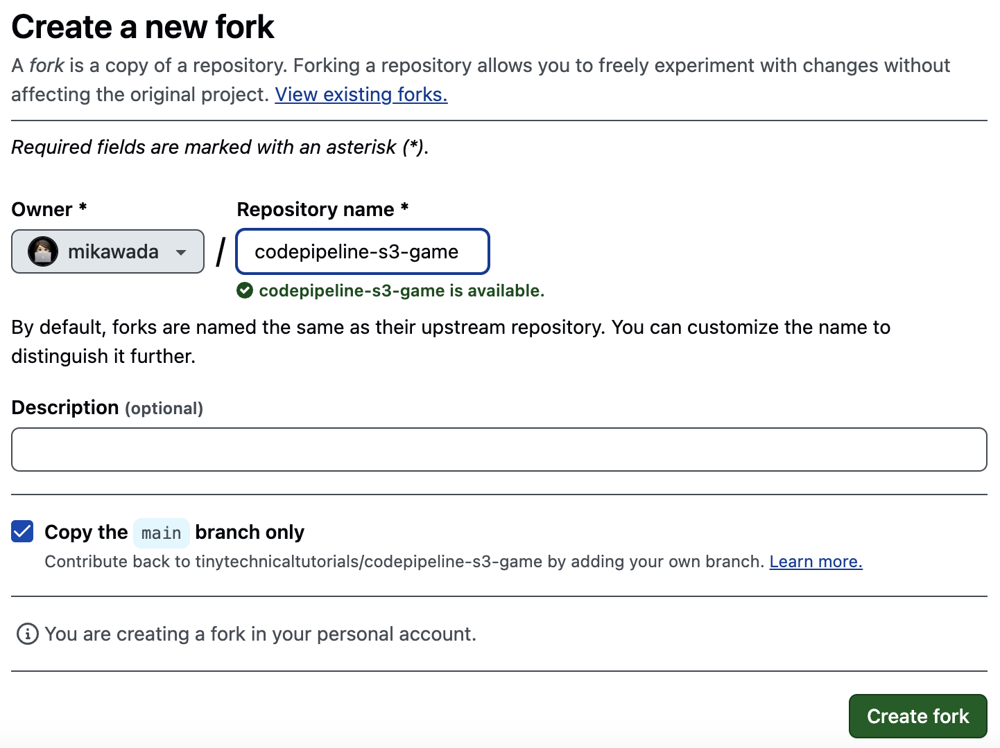

### Step 2: Create S3 Bucket

Next, I created a new S3 bucket, ensuring that static web hosting was enabled and set the hosting type to "static website." I also specified the default page of the website, which is **index.html**, located in the GitHub repository I forked in step 1. 
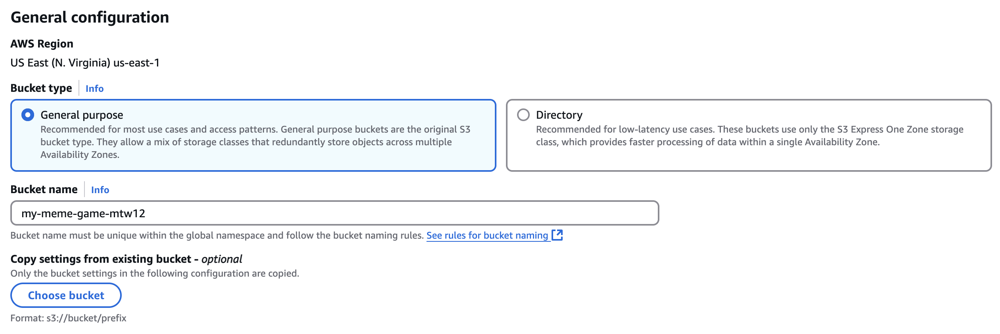 
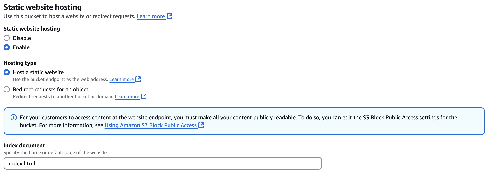

To configure the permission settings, I set up a bucket policy by adding a JSON code that allows all users to "get object" (read) the files in the newly created S3 bucket. This ensures smooth access to the website without any permission issues. 
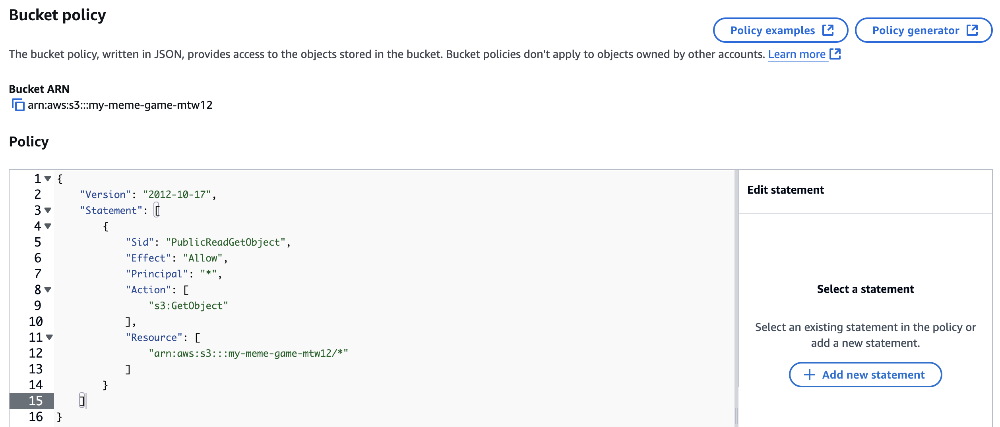

### Step 3: Set Up CodePipeline

Next, I created a new pipeline in AWS CodePipeline to automate and connect GitHub and S3. I started by configuring the basic settings for the pipeline. 
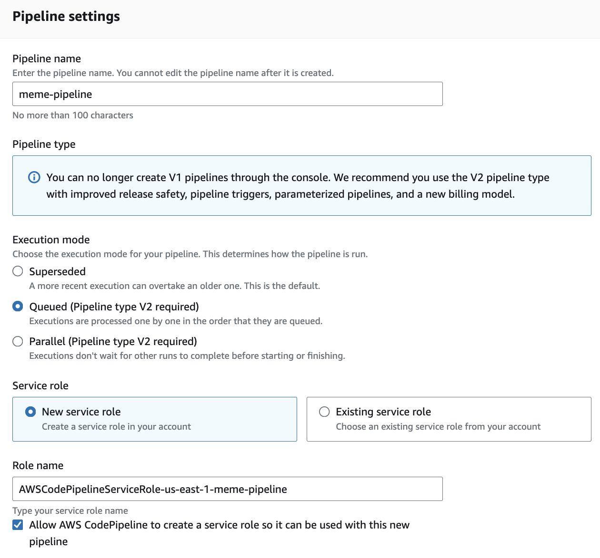

Then, I proceeded to GitHub to the new pipeline. When prompted to specify a source provider, I selected GitHub from the dropdown menu and clicked **Connect to GitHub**. After being redirected to my GitHub account, I granted AWS permission to access the relevant repositories. Once connected, I selected the specific repository I wanted to link and set the default branch to **main**. 
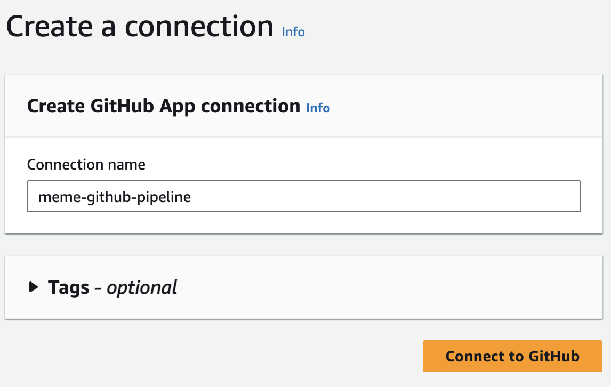 
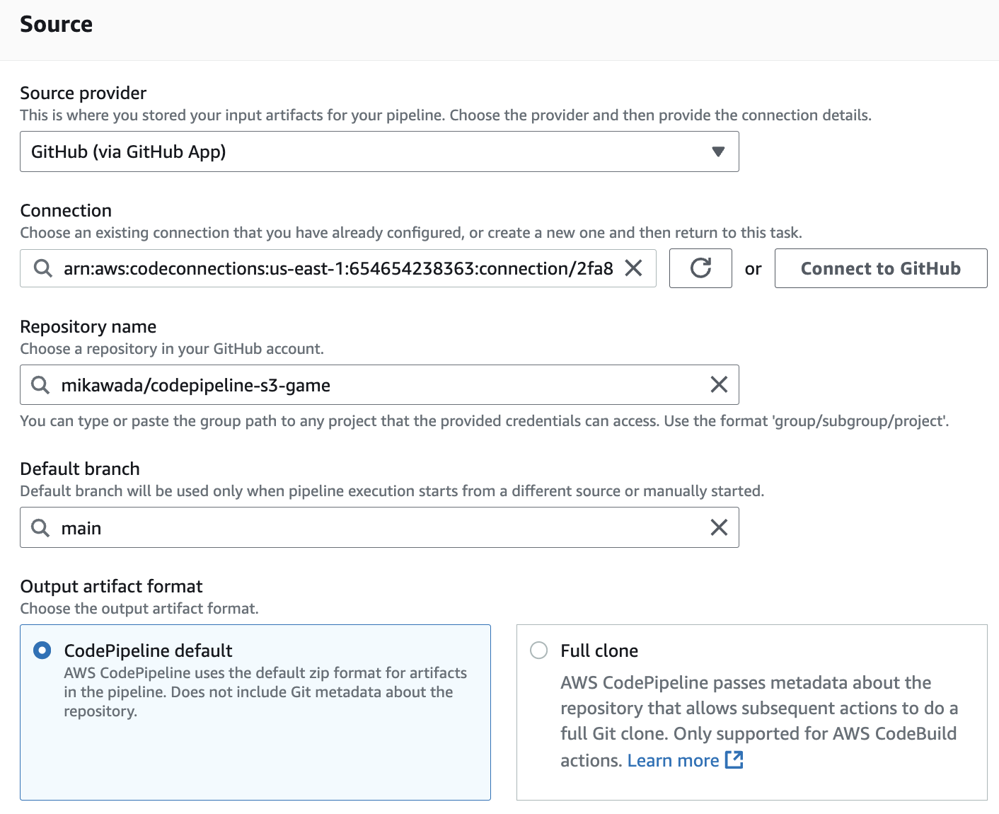

For the **deploy** stage, I selected S3 as the deployment provider and chose the closest region in the settings. I also specified the bucket name to connect the pipeline to the S3 bucket I created in step 2. 
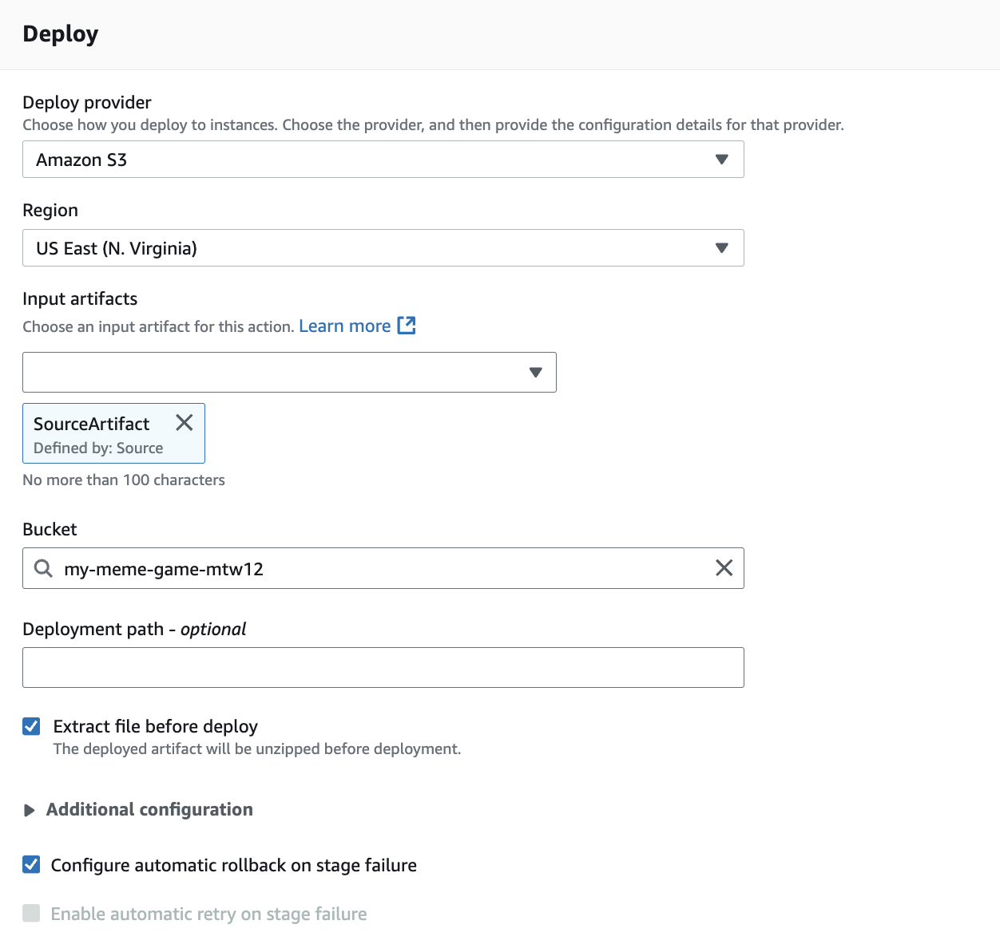

Once I created the new pipeline, I confirmed that the source (GitHub) was successfully connected and the deployment to S3 was completed. 
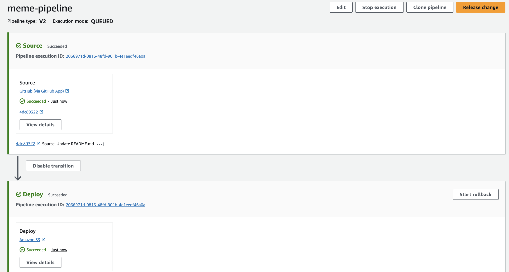

To verify that the website had been successfully deployed, I returned to my S3 bucket, went to the **Properties** tab, and located the bucket website endpoint (the link to the website). 
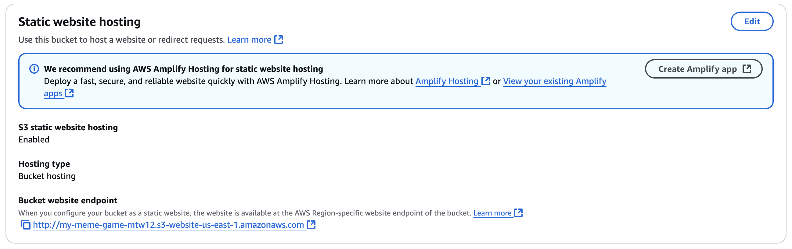

Once I clicked on the link, a new tab opened, and the game website loaded successfully, with all its interactive features working as well. 
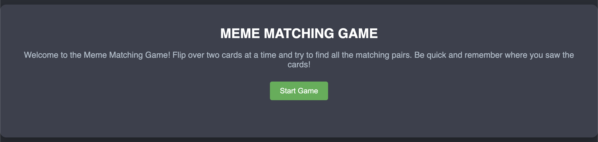 
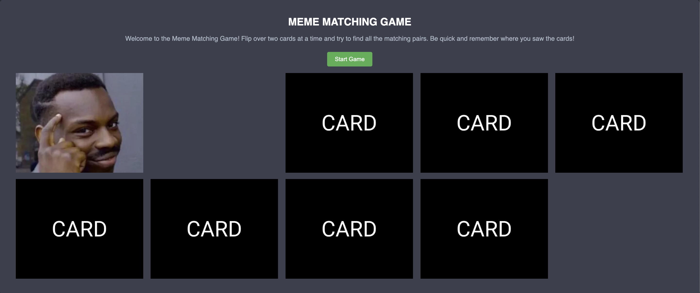

### Step 4: Commit Code Change in GitHub

Now that the website was up and running, the final step was to check if any code changes committed on GitHub would be reflected in the pipeline and, ultimately, the S3 website. I returned to the GitHub repository I forked in step 1, opened the **index.html** file, and made a small change to the game instructions. I then committed the changes. 
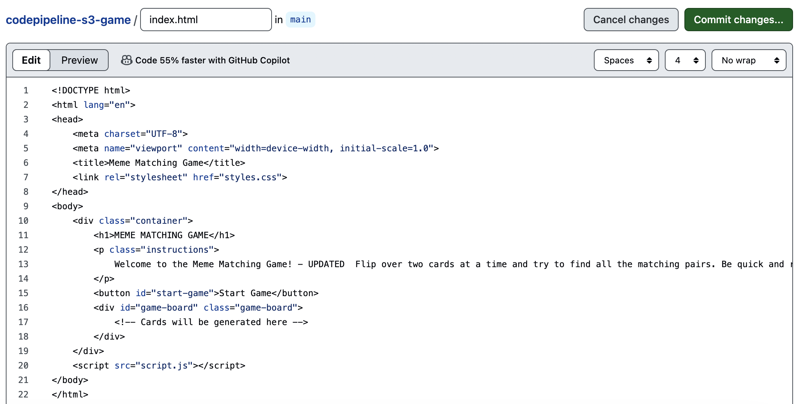

I returned to CodePipeline in the console and saw that the pipeline immediately detected the change in the GitHub repository. The Source stage was marked as "in progress" as it retrieved the latest code. 
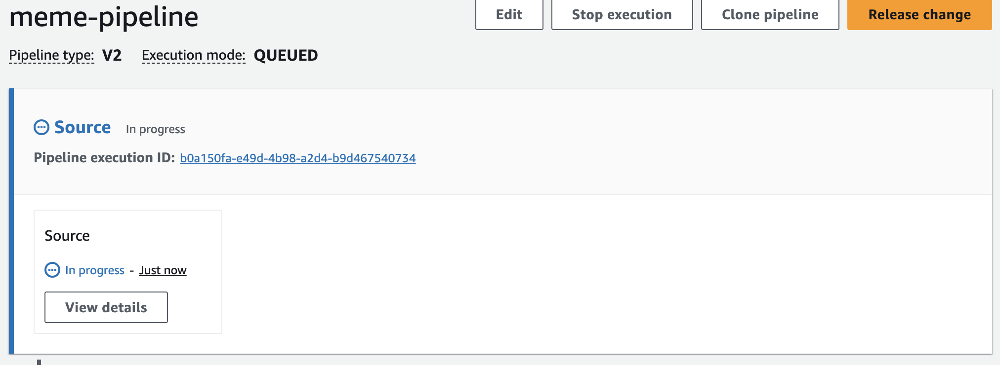

Once the Source stage was fully loaded, I returned to the S3 website, refreshed the page, and confirmed that the changes made to the **index.html** file were successfully reflected on the game website. 
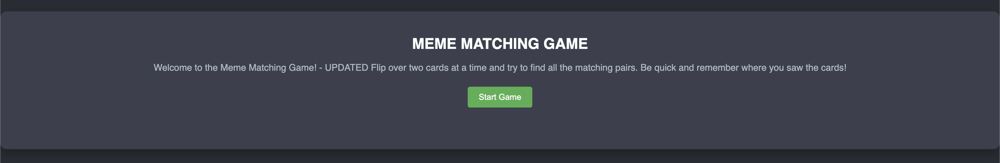

## Conclusion

This guided project by @tinytechnicaltutorials gave me the opportunity to apply the concept of continuous deployment to a hands-on project, showing how CodePipeline connects sources like GitHub and S3. As I become more familiar with CodePipeline, I look forward to tackling more complex projects that fully demonstrate why CodePipeline is such a valuable tool in real-world applications.
